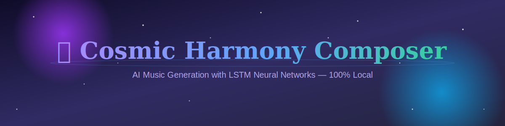

# 🎵 Cosmic Harmony Composer

[](https://www.python.org/downloads/)
[](https://tensorflow.org)
[](https://flask.palletsprojects.com/)
[](https://opensource.org/licenses/MIT)
[](.)

---

<div align="center">

## ✨ AI Music Generator with LSTM Neural Networks ✨

**Trained and run entirely locally — No external APIs, no API keys, no internet dependency**

</div>

---

## 🎨 Banner



---

## 🌟 Why This Is Different

Unlike ChatGPT, Claude, or Google's music APIs, **Cosmic Harmony Composer is a true deep-learning generative model**:

✅ **No LLM calls** — This is a specialized neural network for music, not a language model  
✅ **No API keys needed** — Train and generate entirely offline  
✅ **100% open source** — TensorFlow, Keras, and Music21  
✅ **Lightweight** — Trains in 30-60 seconds on CPU  
✅ **Privacy-first** — Your compositions never leave your machine  

---

## 🎨 Features at a Glance

| Feature | Details |
|---------|---------|
| **Neural Architecture** | 2-layer LSTM (128 units each) |
| **Training Speed** | ~30-60 seconds on CPU |
| **Generation Capacity** | 50–500 note compositions |
| **Output Format** | Playable `.mid` files |
| **Naming** | Auto-themed cosmic titles (Nebula Dreams, Black Hole Mystery, etc.) |
| **UI** | Space-themed, responsive, zero-framework |

---

## 🖥️ Dashboard Preview


*Interactive training and generation dashboard — train your model, generate symphonies, download MIDI files*

---

## ⚙️ How It Works


*From note corpus to downloadable MIDI — entirely on your machine with no internet required*

---

## 🚀 Quick Start

### Prerequisites

- Python 3.8 or higher
- ~500MB disk space (for TensorFlow)
- No internet required after installation

### Installation & Setup

```bash
git clone https://github.com/ASHWIN07026/Cosmic-Harmony-Composer.git
cd Cosmic-Harmony-Composer

python -m venv venv
source venv/bin/activate      # On Windows: venv\Scripts\activate

pip install -r requirements.txt

python app.py
```

Open your browser to **http://localhost:5000** 🌌

---

## 🎼 How to Use

### Step 1: Train the Model

Click **"Train Model"** — the LSTM network learns from the cosmic musical corpus in ~30-60 seconds.

```
Training Progress
████████░░ 80%
Loss: 0.342  •  Elapsed: 41s  •  Remaining: ~10s
```

### Step 2: Generate a Symphony

1. Select the number of notes (50–500)
2. Click **"Generate Cosmic Symphony"**
3. Watch your original composition be created in real-time

### Step 3: Download & Play

Click **"Download MIDI File"** to save your unique composition. The file is automatically named after a cosmic theme.

**Example generated filenames:**
- `nebula_dreams_2024.mid`
- `black_hole_mystery_2024.mid`
- `stardust_symphony_2024.mid`
- `cosmic_aurora_2024.mid`

---

## 🎵 Playing Your Compositions

| Platform | Tools | Notes |
|----------|-------|-------|
| **Windows** | Windows Media Player, GarageBand, DAWs | Direct MIDI support |
| **Mac** | GarageBand, QuickTime | Built-in MIDI player |
| **Linux** | Audacity, fluidsynth, VLC | Lightweight options |
| **Browser** | [Online Sequencer](https://onlinesequencer.net) | No installation needed |

### Convert to MP3 (Optional)

```bash
sudo apt-get install fluidsynth ffmpeg

fluidsynth -a alsa -m alsa_seq -F output.wav /usr/share/sounds/sf2/FluidR3_GM.sf2 input.mid
ffmpeg -i output.wav -q:a 9 output.mp3
```

---

## 📁 Project Structure

```
cosmic-harmony-composer/
├── app.py                       # Flask backend & LSTM training
├── requirements.txt             # Python dependencies
├── templates/
│   └── index.html              # Web interface
├── static/
│   ├── css/style.css           # Space-themed styling
│   └── js/main.js              # Interactive controls
├── models/                     # Saved LSTM models & mappings
├── generated_music/            # Output MIDI files
├── docs/
│   └── images/
│       ├── banner.png
│       ├── dashboard-mockup.png
│       └── how-it-works.png
└── README.md
```

---

## 🛠️ Tech Stack

**Backend:** Flask (lightweight web framework)  
**Deep Learning:** TensorFlow/Keras (LSTM neural network)  
**Music:** Music21 (MIDI generation & manipulation)  
**Frontend:** HTML5 + CSS3 + Vanilla JavaScript  
**Model:** 2-layer LSTM, 128 units each  
**Training:** 30-60 seconds on CPU

---

## 🎯 Customization

### Use Your Own MIDI Files

```python
# In app.py, find get_notes_from_sample_data()
def get_notes_from_sample_data():
    midi_files = glob("your_corpus/*.mid")  # Your MIDI collection
    return extract_notes(midi_files)
```

Suggested sources:
- **MuseScore** — Free sheet music with MIDI downloads
- **FreeMIDI** — Archive of freely licensed MIDI files
- **Your own compositions** — Train on your personal music

### Adjust Hyperparameters

```python
model = Sequential([
    LSTM(128, input_shape=(lookback, num_unique_notes), return_sequences=True),
    Dropout(0.2),
    LSTM(128, return_sequences=False),
    Dropout(0.2),
    Dense(num_unique_notes, activation='softmax')
])

model.compile(optimizer=Adam(learning_rate=0.001), loss='categorical_crossentropy')
```

**Key parameters:**
- `LSTM units`: Increase for more complex patterns (256, 512)
- `Dropout`: Adjust to prevent overfitting (0.2–0.5)
- `learning_rate`: Fine-tune convergence speed

---

## 📊 Performance & Benchmarks

| Metric | Value |
|--------|-------|
| **Model Size** | ~2-5 MB (trained weights) |
| **Training Time (CPU)** | 30–60 seconds |
| **Training Time (GPU)** | 5–10 seconds |
| **Generation Speed** | < 1 second per 100 notes |
| **Memory Usage (Training)** | ~150 MB |
| **Memory Usage (Idle)** | ~50 MB |
| **Inference Speed** | Real-time on any modern CPU |

> **Note:** TensorFlow is the largest dependency (~500MB+). On resource-constrained machines, training still completes in under a minute due to the small sample corpus.

---

## 🚀 Roadmap

- [ ] **Web deployment** — Host on Heroku/Vercel (with model caching)
- [ ] **Advanced controls** — Tempo, key, instrument selection
- [ ] **Multi-instrument support** — Polyphonic generation
- [ ] **Audio visualization** — Waveform + spectral display
- [ ] **Export formats** — MusicXML, MP3, WAV
- [ ] **Community corpus** — Crowdsourced training data
- [ ] **Model versioning** — Save and load different trained models

---

## 🤝 Contributing

We welcome contributions! Here's how:

1. **Fork** the repository
2. **Create a feature branch** (`git checkout -b feature/amazing-feature`)
3. **Commit** your changes (`git commit -m 'Add amazing feature'`)
4. **Push** to your branch (`git push origin feature/amazing-feature`)
5. **Open a Pull Request**

### Ideas for Contributions

- Better music training corpora (more MIDI files)
- Improved UI/UX (modern design, better controls)
- Hyperparameter tuning (for faster/better training)
- Docker containerization (easy deployment)
- Cloud deployment guides (AWS, Google Cloud, Azure)
- Documentation improvements
- Bug fixes and performance optimizations

---

## ⚠️ Troubleshooting

### `ModuleNotFoundError: No module named 'tensorflow'`

```bash
pip install --upgrade tensorflow
```

### Port 5000 Already in Use

```bash
python app.py --port 5001
```

### Slow Training on CPU

This is expected! TensorFlow on CPU is slower than GPU. For faster training with NVIDIA GPU:

```bash
pip install tensorflow[and-cuda]
```

### MIDI Won't Play

Try an online player:
- [Online Sequencer](https://onlinesequencer.net) — drag & drop your `.mid` file
- [MusicXML.com](https://musicxml.com)
- VLC Media Player (works offline)

### Model Not Training / Loss Not Decreasing

- Check that training data is valid (notes extracted correctly)
- Increase number of epochs in `app.py`
- Adjust learning rate (try 0.0001 or 0.0005)
- Ensure sufficient training data samples

---

## 📚 Resources & Learning

- **TensorFlow LSTM Guide:** https://www.tensorflow.org/guide/keras/rnn
- **Music21 Documentation:** https://web.mit.edu/music21/
- **Flask Tutorial:** https://flask.palletsprojects.com/
- **Deep Learning for Music:** https://arxiv.org/search/?query=music+generation

---

## 📄 License

This project is licensed under the **MIT License** — see [LICENSE](LICENSE) for details.

**In plain English:** You're free to use, modify, and distribute this project for personal and commercial purposes. Just include the original license in your distribution.

### Third-Party Licenses

- **TensorFlow**: Apache 2.0
- **Flask**: BSD 3-Clause
- **Music21**: LGPL 3.0

---

## 💡 Citation

If you use Cosmic Harmony Composer in research or projects, please cite:

```bibtex
@software{cosmic_harmony_2024,
  title = {Cosmic Harmony Composer: LSTM-Based Music Generation},
  author = {ASHWIN07026},
  year = {2024},
  url = {https://github.com/ASHWIN07026/Cosmic-Harmony-Composer}
}
```

---

## 🌟 Show Your Support

If you find this project useful, please **⭐ Star** this repository! It helps others discover the project and motivates continued development.

---

## 📬 Get in Touch

- **Issues**: Report bugs or request features on [GitHub Issues](https://github.com/ASHWIN07026/Cosmic-Harmony-Composer/issues)
- **Discussions**: Join our community on [GitHub Discussions](https://github.com/ASHWIN07026/Cosmic-Harmony-Composer/discussions)

---

<div align="center">

**Made with 🚀 and 🎵 for music lovers and AI enthusiasts**

[⬆ Back to Top](#-cosmic-harmony-composer)

</div>
